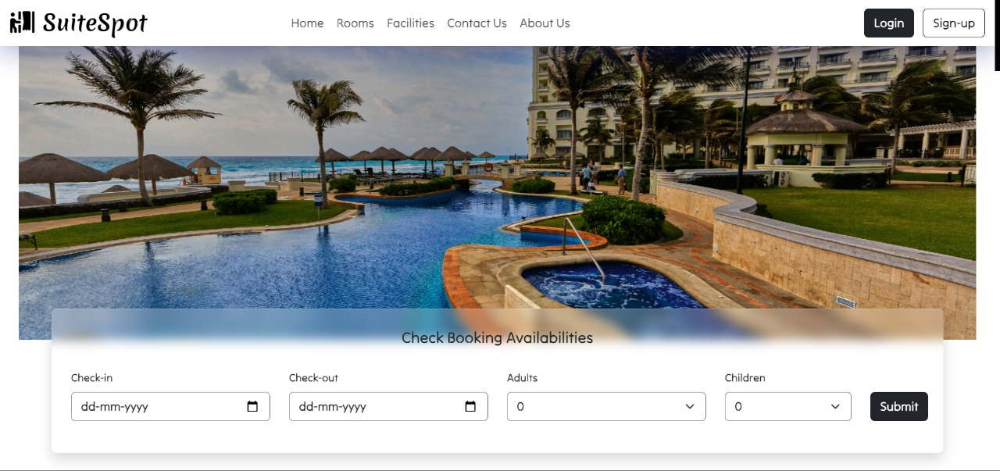

# SuiteSpot



## 📋 Project Description
**SuiteSpot** is a comprehensive hotel management system designed to streamline and automate hotel operations. This project aims to provide an efficient solution for managing reservations, customer information, and other hotel-related tasks. With a focus on user experience and functionality, SuiteSpot integrates modern web technologies to deliver a seamless management experience.


## 🌟 Features
- **Reservations:** Efficiently manage room bookings and reservations with an intuitive interface.
- **Customer Management:** Maintain detailed records of customer information and history.
- **Billing:** Generate invoices and manage payments with ease.
- **Reports:** Create and view various reports for better management insights.
- **User Roles:** Different access levels for staff, managers, and administrators.
- **Notifications:** Real-time notifications for reservations, payments, and more.
- **Analytics:** Visualize data through charts and graphs for informed decision-making.


## 💻 Technologies Used
- **Frontend:**
  <p align="left">
    
    
    
    
  </p>

- **Backend:**
  <p align="left">
    
    
  </p>

- **Database:**
  <p align="left">
    
  </p>

**Impact:** Improved user tracking accuracy and user engagement through real-time updates.

## ⚙️ Installation
To run this project locally, follow these steps:


1. **Clone the repository:**
   ```bash
   git clone https://github.com/omshreevinayak/SuiteSpot.git
   cd SuiteSpot
